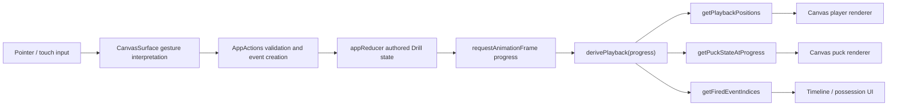

# PHICECRAFT Master Hockey Mechanics Review and Repair Plan

Status: executed in the working tree, 2026-07-17
Repository: `C:\phicecraft`
Current branch: `codex/hockey-drill-engine`
Primary source prompt: `C:\Users\assoc\.codex\attachments\60341035-450a-4b8e-bc9a-26ee065d358f\pasted-text.txt`

## 1. Executive summary

The supplied master prompt is a strong review framework, but it was written for a real-time 3D engine with concepts such as Rigidbodies, physics layers, prefabs, root motion, and fixed-update callbacks. PHICECRAFT is instead a React 18, TypeScript, Vite, Canvas 2D application. Its drill is authored as player routes plus puck events and replayed by deterministic pure functions.

The existing application should be repaired in place. A replacement project is not required. The current strengths are worth preserving:

- Regulation-scale 200 × 85 ft rink data.
- A single React reducer for authored drill state.
- A single request-animation-frame playback loop.
- Pure functions that derive player and puck positions from drill data and time.
- Explicit initial carrier, pass, catch/miss, loose puck, pickup, shot, and result data.
- Undo/redo, persistence, four-step workflow, and 162 passing tests.
- A verified player-to-player pass where the puck meets a moving receiver's stick.

The main mechanical weakness is that every skater currently advances along an arbitrary polyline using the same global normalized easing curve. Route length, player velocity, acceleration, stopping distance, turn radius, movement state, and role do not determine travel. This makes the motion readable as a diagram but not convincing as hockey.

The repair strategy is to keep the route-based coaching workflow while adding a deterministic fixed-step simulation compiler behind it:

```text
Authored drill
→ compile route and event intent
→ fixed-step skater and puck simulation
→ cached immutable simulation frames
→ canvas rendering and timeline scrubbing
```

This gives PHICECRAFT hockey-like acceleration, edge turns, stops, receptions, loose-puck pursuit, board interactions, and frame-rate independence without introducing a second controller or a heavyweight 3D engine.

Player graphics should remain procedural Canvas vectors initially. A top-down skater built from a torso, helmet, shoulders, arms, gloves, skates, and stick can rotate and animate from the authoritative movement state, stay sharp at every zoom, retain team colors and jersey numbers, and avoid sprite-sheet synchronization problems. Edit mode can remain token-like; Review playback should show the detailed skater.

## 2. Review of the supplied master prompt

### Keep as written

- Inspect before changing.
- Establish one authority per responsibility.
- Trace input to visible gameplay.
- Convert subjective feel problems into measurable failures.
- Fix movement before advanced puck and shot tuning.
- Define possession and reception explicitly.
- Centralize configuration and units.
- Require automated and live runtime verification.
- Preserve deterministic reset and repeatability.
- Do not claim mechanical completion from graphics alone.

### Translate to this repository

| Generic prompt concept | PHICECRAFT implementation |
| --- | --- |
| Scene/prefab | A versioned `Drill` JSON document and factory functions |
| Rigidbody player | Deterministic `SimSkater` position, velocity, heading, and state |
| Rigidbody puck | Deterministic `SimPuck` position, velocity, spin, owner, and state |
| FixedUpdate | A pure fixed-step simulation at a configured tick rate |
| Collider | Analytic rink, board, post, net, stick, and pickup geometry |
| Physics material | Typed ice/board/post coefficients in mechanics configuration |
| Animation controller | A procedural `SkaterPose` derived from simulation state |
| Root motion | Not used; simulation remains authoritative |
| Scriptable object | Versioned TypeScript configuration with validation |
| Physics layers | Collision categories and masks used by the 2D solver |
| Main scene | `src/App.tsx` plus the currently loaded drill |
| Player controller | Route compiler plus skater motor |
| Puck controller | Puck state machine plus collision and possession solvers |

### Defer until the core is stable

- Saucer, bank, rim, and drop passes.
- Multiple shot families and complex shot spin.
- Competitive defenders and player-to-player body contact.
- Broadcast-tilted camera.
- Full controller-driven real-time gameplay.
- Bitmap sprite production.

The first supported product remains a deterministic coaching drill creator. It should feel like hockey in playback without becoming an uncontrolled arcade simulation.

## 3. Current project architecture

| Area | Current implementation |
| --- | --- |
| Engine | React 18 application with HTML Canvas 2D rendering |
| Build | Vite 4 and TypeScript 5 |
| Input | Pointer, touch/pinch, and wheel handlers in `CanvasSurface.tsx` |
| Authored state | `AppState.drill` managed by `appReducer` |
| Playback clock | `requestAnimationFrame` in `CanvasSurface.tsx` |
| Movement | Polyline sampling through one normalized global easing curve |
| Puck | Pure derived state in `engine/playback.ts`; possession chain in `engine/puck.ts` |
| Rendering | `RinkRenderer`, `PlayerRenderer`, and `PathRenderer` |
| Persistence | Versionless localStorage drill JSON with repair/validation |
| Drill lifecycle | Authoring plus play/pause/scrub/reset; no scoring lifecycle state machine yet |
| Test baseline | 162 Vitest tests passing; TypeScript build and ESLint passing |
| Main entry | `src/main.tsx` → `src/App.tsx` |

The official [2025–2026 NHL rulebook](https://media.nhl.com/site/asset/public/ext/2025-26/2025-26Rules.pdf) remains the geometry authority. PHICECRAFT already models a 200 × 85 ft sheet, 11 ft goal-line offsets, and a 50 ft neutral zone in `src/core/constants.ts`.

## 4. Current gameplay system map



### Current authority map

| Responsibility | Authoritative code | Conflict status | Required action |
| --- | --- | --- | --- |
| Pointer input | `components/CanvasSurface.tsx` | One authority, but too large | Split by responsibility without adding another input path |
| Authored drill state | `core/state.ts` | One authority | Preserve |
| Player position | `engine/playback.ts` | One authority, simplistic model | Replace internals behind the same sampling API |
| Puck playback position | `engine/playback.ts` | One authority | Move to compiled simulation frame |
| Possession validation | `engine/puck.ts` | One authority | Merge with explicit simulation possession state |
| Pass creation | `hooks/useAppState.tsx` | One authority, UI-coupled physics | Move calculations into simulation/pass solver |
| Render loop | `CanvasSurface.tsx` | One authority | Keep one loop; render compiled frames |
| Player graphics | `canvas/PlayerRenderer.ts` | One authority | Replace circle body with state-driven skater pose |
| Persistence | `storage/localStorage.ts` | One authority | Add schema version and migrations |

## 5. Root-cause matrix

| Priority | System | Symptom | Confirmed root cause | Files | Correction | Acceptance test |
| --- | --- | --- | --- | --- | --- | --- |
| P0 | Skating speed | Short and long routes both finish in the same drill time | All routes use one normalized `getSkatingProgress` curve | `engine/playback.ts` | Compile route distance into velocity-limited segment timing | Two routes of different lengths respect the same configured max speed |
| P0 | Turning | Skaters can follow unrealistically sharp curves at full speed | Heading is a finite-difference tangent; no angular velocity or radius constraint | `engine/playback.ts` | Add speed-dependent turn-rate limit and route feasibility warnings | High-speed route produces wider turn or warning |
| P0 | Stopping | Every player eases only at the global end of playback | No authored stop/brake segment or per-player state | `types.ts`, `playback.ts` | Typed route segments and a skater state machine | Stop point and stopping distance are deterministic |
| P0 | Reception | Catch success is authored rather than evaluated | `catchResult` is a stored flag; no catch-volume/speed/angle solver | `playback.ts`, `puck.ts` | Evaluate reception eligibility at arrival, then store/preview result | Puck and moving blade coincide on success; miss stays loose |
| P1 | Event timing | Dense action chains can compress near normalized time `0.94–0.98` | Events use normalized time and hard clamps | `useAppState.tsx`, `types.ts` | Move canonical timing to seconds and compile normalized UI values | Event times remain ordered and editable for long drills |
| P1 | Loose puck | Corner and board motion are only approximately hockey-like | Rectangular coordinate reflection; no rounded board normals | `playback.ts`, `constants.ts` | Analytic rounded-rink collision solver with restitution/friction | Repeatable end-board and curved-corner rebound tests |
| P1 | Shooting | Goal/save/rebound/wide is mainly selected manually | No goal mouth, post, goalie, or goal-line collision evaluation | `types.ts`, `playback.ts`, `EventInfoPanel.tsx` | Add shot trajectory and deterministic result resolver | High-speed goal-line crossing registers exactly once |
| P1 | Drill lifecycle | Playback ends and immediately resets to editing state | No Ready/Active/Success/Failure/Review lifecycle | `state.ts`, `CanvasSurface.tsx` | Add explicit lifecycle and retain final review frame | Completion enters Review and does not erase the result frame |
| P1 | Puck authority | Possession is split between event-chain derivation and playback frame derivation | `engine/puck.ts` and `engine/playback.ts` independently infer state | Both engine files | One `SimulationFrame.puck` authority; editor queries compiled result | One owner maximum at every tick |
| P2 | Player appearance | Players read primarily as glowing circles | Renderer has a circular body and only minimal route-facing line art | `canvas/PlayerRenderer.ts` | Procedural top-down skater and goalie renderers | Helmet, torso, arms, skates, and stick readable at normal zoom |
| P2 | Maintainability | Input, hit testing, playback loop, and canvas orchestration share one large component | `CanvasSurface.tsx` owns several unrelated responsibilities | `CanvasSurface.tsx` | Extract hooks and pure interaction helpers | Component becomes orchestration-only; behavior tests remain green |
| P2 | Tuning | Important values use local defaults such as 55 ft/s and raw friction constants | No centralized versioned mechanics configuration | `constants.ts`, `playback.ts` | Add named typed configs with units and ranges | No gameplay magic number remains in solvers |
| P2 | Saved drills | Future data changes can silently reinterpret old drills | Stored `Drill` has no schema version | `types.ts`, `storage/localStorage.ts`, `engine/drill.ts` | Add `phicecraft.drill.v2` migration | Existing saved drill loads identically after migration |
| P3 | Performance | Repeated linear searches occur during each derived frame | Players and paths are repeatedly located with `find`/`some` | Playback and renderer files | Compile ID maps and path lookup once per drill revision | Stable 60 fps with target player count and effects enabled |

## 6. Target mechanics specification

### 6.1 Deterministic simulation clock

- Canonical drill timing is seconds, not normalized progress.
- Default fixed step: `1 / 120 s`; configurable for tests.
- Playback speed changes wall-clock presentation only.
- Scrubbing samples cached compiled frames and never depends on browser frame rate.
- The same drill, seed, and config must produce byte-equivalent key states at 30, 60, 120, and 144 Hz presentation rates.

### 6.2 Authored data versus simulated data

Authored data describes coaching intent:

- Starting formation.
- Route nodes and movement types.
- Intended release and catch nodes.
- Puck action type and intended receiver.
- Configured outcome overrides where deterministic coaching requires them.

Simulation data describes physical execution:

- Player position, velocity, heading, angular velocity, and movement state.
- Stick blade socket, hand side, stride phase, and lean.
- Puck position, velocity, spin, state, and owner.
- Catch eligibility and correction applied.
- Collision and scoring results.

The renderer receives only a `SimulationFrame`; it never decides possession or physics.

### 6.3 Player movement state machine

Initial states:

```text
idle
starting
accelerating
forward_stride
gliding
carving
pivoting
backward_stride
braking
stopped
preparing_receive
receiving
carrying
passing
shooting
chasing
goalie_set
goalie_shuffle
finished
```

Every state defines entry, exit, speed target, allowed turn rate, stick pose, and visual pose. Incompatible actions cannot run simultaneously.

Recommended starting tuning fields, with values validated during implementation:

| Field | Unit | Purpose |
| --- | --- | --- |
| `maxForwardSpeed` | ft/s | Forward speed cap |
| `maxBackwardSpeed` | ft/s | Backward speed cap |
| `forwardAcceleration` | ft/s² | Push acceleration |
| `backwardAcceleration` | ft/s² | Backward acceleration |
| `coastDeceleration` | ft/s² | Passive ice resistance |
| `brakeDeceleration` | ft/s² | Active hockey stop |
| `lowSpeedTurnRate` | deg/s | Tight low-speed pivot |
| `highSpeedTurnRate` | deg/s | Limited high-speed carve |
| `carrySpeedMultiplier` | ratio | Puck-control speed penalty |
| `receiveAdjustmentLimit` | ft/s | Maximum catch correction |

### 6.4 Route compilation

- A drawn polyline remains an intent path.
- Compiler measures arc length and curvature.
- Nodes can be typed as skate, glide, wait, pivot, backward, stop, or finish.
- Speed profile is solved forward for acceleration limits and backward for required braking.
- Curvature limits maximum speed through each segment.
- Invalid geometry is not silently accepted: it yields a visible warning and optional auto-fix.
- Each player may start and finish independently rather than sharing one global curve.

### 6.5 Puck state machine

```text
possessed
releasing_pass
in_flight
catchable
loose
releasing_shot
shot
rebound
goal
frozen
out_of_play
resetting
```

Invariants:

- At most one `carrierId` exists.
- Pass/shot release clears ownership before velocity begins.
- Only the puck solver changes puck state during simulation.
- Successful reception confirms ownership exactly once.
- Miss, dump, rebound, post, and wide results create a loose puck unless explicitly dead.

### 6.6 Passing and reception

Basic direct pass pipeline:

```text
author release point
→ determine pass intent
→ rank receiver candidates within assist cone
→ solve lead interception
→ preview reachability
→ release puck once
→ enter receiver preparation
→ evaluate catch window
→ caught or loose
```

Reception evaluates:

- Blade-to-puck distance.
- Puck speed.
- Approach angle.
- Player facing and turn time.
- Player movement state.
- Assistance setting.
- Obstacle/board interference.

Assistance may adjust only the receiver's final route section within configured speed and distance limits. It must never change target after release.

### 6.7 Puck and collision model

- Ice friction decelerates velocity once.
- Board rebound uses the local normal of straight boards or rounded corners.
- Restitution and tangential friction are separate.
- Goal posts are circles; goal line is a nonphysical crossing detector.
- Net depth and back mesh stop or damp a scored puck.
- Stick contact is enabled only during possession, reception, pickup, or deliberate deflection windows.
- Initial version keeps player-to-player collisions nonphysical to preserve drill readability.

### 6.8 Collision matrix

| A | B | Physical collision | Trigger/query |
| --- | --- | --- | --- |
| Skater | Boards | Yes, kinematic constraint | Board proximity warning |
| Skater | Skater | No in first repair | Overlap warning |
| Skater | Drill target | No | Yes |
| Puck | Ice | Friction model | No |
| Puck | Boards | Yes | Impact event |
| Puck | Goal post | Yes | Post result |
| Puck | Net | Damped collision | Goal-state dependent |
| Puck | Goal line | No | Goal crossing |
| Puck | Stick | Conditional | Catch/pickup/deflection |
| Stick | Own skater | No | No |
| UI object | Gameplay | No | UI hit testing only |

## 7. Detailed player graphics plan

### 7.1 Visual goal

Players must look like top-down hockey players while remaining readable coaching objects. Do not replace them with photorealistic figures that obscure route lines or jersey numbers.

### 7.2 Two display levels

**Edit mode**

- Compact numbered jersey token.
- Clear team color and role.
- Visible facing chevron and stick side.
- Large invisible hit target remains separate from drawn body.
- Route handle and selection rings remain unchanged.

**Review/playback mode**

- Tapered jersey torso rather than a circle.
- Helmet/head at the forward end of the body.
- Shoulder pads and two articulated arms.
- Gloves positioned on the stick shaft.
- Left/right skate boots plus narrow silver blades.
- Stick shaft and curved blade ending at the authoritative puck socket.
- Jersey number rendered on the back/torso.
- Team trim, white outline, ice contact shadow, and subtle highlight.
- Goalie-specific mask, chest protector, leg pads, blocker, catcher, and goalie stick.

### 7.3 Procedural pose data

Add a render-only pose derived from simulation state:

```ts
interface SkaterPose {
  heading: number;
  lean: number;
  stridePhase: number;
  leftLegAngle: number;
  rightLegAngle: number;
  shoulderAngle: number;
  stickAngle: number;
  stickSide: 'forehand' | 'backhand';
  bladePosition: Point;
  action: 'idle' | 'stride' | 'turn' | 'stop' | 'receive' | 'pass' | 'shot';
}
```

### 7.4 Animation details

- Stride phase advances by distance traveled, not browser frame count.
- Acceleration uses deeper knee bend and wider stride.
- Glide narrows the legs and reduces body motion.
- Turn applies inside-edge lean and crossover leg placement.
- Stop rotates both skates across velocity and emits a short snow wedge.
- Receive turns shoulders and blade toward the incoming puck.
- Pass shifts hands and extends the stick through the release point.
- Shot plants the inside skate, loads the torso, then releases at the authored frame.
- Goalie tracks puck angle, shuffles, sets, saves, freezes, and recovers.

### 7.5 Renderer structure

New files:

- `src/canvas/skater/SkaterPose.ts`
- `src/canvas/skater/SkaterRenderer.ts`
- `src/canvas/skater/GoalieRenderer.ts`
- `src/canvas/skater/SkaterEffects.ts`
- `src/canvas/skater/skaterPalette.ts`

Modify:

- `src/canvas/PlayerRenderer.ts` to become the edit/play render dispatcher.
- `src/components/CanvasSurface.tsx` to pass `SimulationPlayerFrame` data.
- `src/core/types.ts` for handedness and optional visual profile.
- `src/core/constants.ts` to separate drawn dimensions from hit-test dimensions.

### 7.6 Level of detail and accessibility

- Far zoom: simplified torso, helmet, number, and stick.
- Normal zoom: full procedural skater.
- Close zoom: gloves, blades, trim, snow, and stick blade.
- Reduced-effects setting disables glow, snow, and motion streaks.
- Colorblind option adds team outline patterns, not just color changes.
- Numbers remain legible at every supported zoom.

Image generation may be used to create a non-production concept sheet and palette reference. Production should begin with procedural vectors because they rotate, scale, recolor, and synchronize with stick sockets more reliably than generated raster sprites.

## 8. Phased implementation plan

### Phase 0 — Preserve, baseline, and instrument

**Objective**

Create a reproducible baseline before changing architecture.

**Work**

- Preserve the current dirty worktree; do not overwrite or reset user changes.
- Record current branch, test result, build output, and live screenshots.
- Export the current `#11 → #13` pass drill as a regression fixture.
- Add a mechanics diagnostics flag and nonproduction overlay shell.
- Document current movement, puck, event, and reset behavior.

**Files**

- Add `docs/MECHANICS_BASELINE.md`.
- Add `src/fixtures/giveAndGo.v1.ts`.
- Add `src/components/DiagnosticsOverlay.tsx`.
- Modify `src/core/types.ts` and `src/core/constants.ts` only for the debug flag.

**Tests**

- Existing 162 tests.
- Production build and lint.
- Browser playback capture at release, catch, and completion.

**Gate**

Baseline fixture reproduces the live drill and can be replayed without localStorage.

### Phase 1 — Establish the simulation boundary and schema v2

**Objective**

Separate authored intent from simulated state without changing visible behavior.

**Work**

- Add `phicecraft.drill.v2` schema version.
- Introduce authored route/event types and simulation-frame types.
- Add `compileDrill(drill, config)` and `sampleFrame(timeSeconds)` interfaces.
- Adapt current playback functions behind the new interface first.
- Compile player/path lookup maps once per drill revision.
- Add v1 → v2 migration and round-trip tests.

**Files**

- Add `src/sim/types.ts`.
- Add `src/sim/config.ts`.
- Add `src/sim/compileDrill.ts`.
- Add `src/sim/sampleFrame.ts`.
- Add `src/storage/migrations.ts`.
- Modify `src/core/types.ts`, `src/core/state.ts`, `src/engine/playback.ts`, `src/storage/localStorage.ts`.

**Risk**

Saved drills could shift timing or event points if migration is not exact.

**Tests**

- Fixture snapshots at `0`, release, catch, shot, and end times.
- Migration preserves player IDs, routes, pass receiver, and possession chain.
- Scrubbing the same time twice returns identical frames.

**Gate**

The new compiled API renders the current live drill without visual or mechanical regression.

### Phase 2 — Hockey skater motor and route compiler

**Objective**

Replace global path easing with per-player hockey movement.

**Work**

- Measure route length and curvature.
- Add typed route nodes: skate, glide, wait, pivot, backward, stop.
- Implement acceleration, coasting, braking, and speed-dependent turn limits.
- Solve forward acceleration and backward braking passes over each route.
- Produce position, velocity, heading, angular velocity, state, and stride phase.
- Add route warnings and optional auto-smoothing.
- Preserve current freehand drawing gesture.

**Files**

- Add `src/sim/skaterMotor.ts`.
- Add `src/sim/routeCompiler.ts`.
- Add `src/sim/movementCurves.ts`.
- Add `src/sim/routeValidation.ts`.
- Modify `src/engine/playback.ts`, `src/components/PlayerInfoPanel.tsx`, `src/components/CanvasSurface.tsx`.

**Tests**

- Acceleration from rest.
- Maximum speed cap.
- Coasting distance.
- Hockey stop distance.
- Low-speed versus high-speed turn radius.
- Forward/backward transition.
- Different route lengths with equal player configuration.
- Identical result under different presentation frame rates.

**Gate**

Players no longer slide uniformly along routes; speed and turn behavior are measurable and configurable.

### Phase 3 — Detailed skater and goalie graphics

**Objective**

Make players visually read as skaters while preserving coaching clarity.

**Work**

- Add procedural skater/goalie renderers and `SkaterPose`.
- Add edit-mode token and review-mode detailed visual switch.
- Animate stride, glide, turn lean, stop, receive, pass, and shot.
- Align drawn stick blade with the simulation stick socket.
- Add shadow, jersey trim, blades, gloves, and subtle snow effects.
- Add reduced-effects and far-zoom LOD.

**Files**

- New `src/canvas/skater/*` files listed in Section 7.5.
- Modify `src/canvas/PlayerRenderer.ts`, `src/components/CanvasSurface.tsx`, `src/styles/index.css`.

**Risk**

More detail can hide numbers and route lines or lower tablet frame rate.

**Tests**

- Visual snapshots at far, normal, and close zoom.
- Stick socket overlay must match blade position within one screen pixel at normal zoom.
- Full-rink playback with target player count remains smooth.
- Home/away/goalie silhouettes remain distinguishable without reading color.

**Gate**

Each playback player visibly has a body, helmet, arms, skates, and stick; the puck still aligns to the blade.

### Phase 4 — Puck physics and rink collisions

**Objective**

Make loose and released puck motion independent, deterministic, and rink-aware.

**Work**

- Add `SimPuck` velocity and one state-machine authority.
- Add fixed-step ice friction and speed limits.
- Replace rectangular reflection with rounded-rink signed-distance collision.
- Add posts, goal line, net depth, and out-of-play regions.
- Emit collision events for diagnostics and shot resolution.

**Files**

- Add `src/sim/puckSolver.ts`.
- Add `src/sim/collision/rinkGeometry.ts`.
- Add `src/sim/collision/puckCollisions.ts`.
- Add `src/sim/collision/goalGeometry.ts`.
- Modify `src/engine/playback.ts`, `src/core/constants.ts`, `src/canvas/PathRenderer.ts`.

**Tests**

- Known-force slide and stop distance.
- Side-board, end-board, and corner rebounds.
- Post collision.
- Maximum-speed no-tunneling test.
- Puck never leaves valid rink geometry unless marked out of play.

**Gate**

Loose puck motion is repeatable, stays inside real rink geometry, and does not reverse after stopping.

### Phase 5 — Possession, direct pass, and reception

**Objective**

Make one reliable ground pass succeed or fail for physical reasons.

**Work**

- Merge editor possession queries and playback possession into `SimulationFrame.puck`.
- Add release, in-flight, catchable, caught, and missed transitions.
- Add pass-assistance cone and receiver candidate scoring.
- Solve moving receiver interception from route/motor frames.
- Evaluate distance, speed, angle, facing, and assistance at catch.
- Add pass preview states: good, assisted, early, late, unreachable.
- Keep current receiver retargeting and loose-action correction UI.

**Files**

- Add `src/sim/passSolver.ts`.
- Add `src/sim/receptionSolver.ts`.
- Add `src/sim/possession.ts`.
- Modify `src/engine/puck.ts`, `src/hooks/useAppState.tsx`, `src/components/EventInfoPanel.tsx`, `src/components/PuckChainBar.tsx`, `src/canvas/PlayerRenderer.ts`.

**Tests**

- Stationary catch.
- Moving lead catch.
- Pass while passer moves.
- Unreachable receiver.
- High-speed failed catch.
- Facing-angle failure.
- Assistance within and beyond configured limits.
- Ownership changes exactly once.

**Gate**

Every pass visibly ends in either receiver possession or a continuing loose puck, with no invisible transfer or skate-by.

### Phase 6 — Loose-puck pursuit and recovery

**Objective**

Allow the drill to continue naturally after misses, dumps, wide shots, and rebounds.

**Work**

- Add authored, nearest-teammate, and competitive recovery policies.
- Predict loose-puck intercept points.
- Compile a temporary pursuit route within acceleration/turn limits.
- Add stick pickup volume and recovery delay.
- Resume, replace, or finish the original route according to authored policy.

**Files**

- Add `src/sim/pursuitSolver.ts`.
- Add `src/sim/pickupSolver.ts`.
- Modify `src/components/PlayerInfoPanel.tsx`, `src/components/EventInfoPanel.tsx`, `src/engine/puck.ts`.

**Tests**

- Recovery only when blade reaches puck.
- Player too far away cannot recover.
- Nearest teammate selection is deterministic.
- Recovered player can pass or shoot next.

**Gate**

No loose-puck event becomes a dead-end unless the coach explicitly inserts a whistle.

### Phase 7 — Shooting, goalie, and scoring

**Objective**

Resolve a basic shot from release through a meaningful result.

**Work**

- Add wrist-shot baseline with aim and speed limits.
- Add goal-line crossing, posts, wide, save/freeze, and rebound.
- Add deterministic goalie tracking and authored outcome override.
- Add goal/save/rebound feedback and final review frame.

**Files**

- Add `src/sim/shotSolver.ts`.
- Add `src/sim/goalieSolver.ts`.
- Add `src/sim/scoring.ts`.
- Modify `src/components/EventInfoPanel.tsx`, `src/canvas/RinkRenderer.ts`, `src/canvas/PathRenderer.ts`.

**Tests**

- One shot input produces one release.
- Goal crosses the line once.
- Post does not score.
- Save/freeze ends possession correctly.
- Rebound produces a recoverable loose puck.

**Gate**

A pass sequence can end with a geometrically and logically consistent shot result.

### Phase 8 — Drill lifecycle, timeline, and validation

**Objective**

Turn playback into a repeatable training scenario rather than a temporary animation.

**Work**

- Add Ready, Countdown, Active, Success, Failure, Review, and Resetting states.
- Preserve final frame in Review.
- Move timeline labels and event editing to real seconds.
- Add one lane per active player plus a puck lane.
- Add blocking errors, realistic warnings, and click-to-focus.
- Add versioned drill metadata, time limit, scoring, and assistance settings.

**Files**

- Add `src/engine/drillLifecycle.ts`.
- Add `src/engine/drillValidation.ts`.
- Add `src/components/Timeline.tsx`.
- Add `src/components/ValidationPanel.tsx`.
- Modify `src/core/state.ts`, `src/core/types.ts`, `src/components/Playbar.tsx`, `src/components/WorkflowBar.tsx`.

**Tests**

- Start, success, failure, timeout, review, reset, repeated reset.
- Success/failure emits once.
- Switching drills stops the previous lifecycle.
- Scrubbing does not mutate authored data.

**Gate**

The same drill can run repeatedly from a known state and produce the same result without duplicated callbacks or stale state.

### Phase 9 — Diagnostics, performance, and production verification

**Objective**

Prove that the repaired mechanics are measurable, stable, and usable on target devices.

**Work**

- Add opt-in vectors for velocity, heading, blade socket, catch radius, pass assist, and collisions.
- Add simulation tick, frame time, and cache statistics.
- Optimize compiled lookup maps and Canvas allocation only after correctness.
- Add reduced-effects tablet mode.
- Add browser regression scripts for core authoring journeys.
- Document mechanics configuration and schema.

**Tests and tools**

- Vitest unit and deterministic snapshot tests.
- TypeScript production build and ESLint.
- Browser-control live tests with mouse-equivalent pointer input.
- Manual touch/pen verification on target hardware.
- Presentation-rate tests at 30, 60, 120, and 144 Hz.
- Repeated run/reset stress test.

**Gate**

All acceptance checks pass, live runtime has no current warnings/errors, and final documentation matches the implementation.

## 9. Tool and skill usage during execution

| Capability | Use |
| --- | --- |
| In-app browser control | Reproduce each mechanic, capture release/catch/result frames, verify UI interactions and current runtime logs |
| Shell and repository inspection | Locate authorities, inspect diffs, run focused tests, full tests, build, and lint |
| `apply_patch` | Make scoped, reviewable edits while preserving unrelated user changes |
| Image inspection | Compare generated/current visuals against the supplied rink and coaching-board references |
| Image generation | Optional skater concept sheet and palette exploration after pose requirements are fixed; not used as a substitute for mechanics |
| Web research | Verify rink and goal geometry against primary rulebook sources |
| Vitest | Pure mechanics, deterministic simulation, migration, and state tests |

Unrelated connectors such as email, calendars, cloud storage, and payments should not be invoked merely to claim broad tool usage; they do not improve this repository task.

## 10. Acceptance checklist at the current baseline

| Requirement | Current status | Evidence / gap |
| --- | --- | --- |
| One authored state authority | PASS | `appReducer` owns drill mutations |
| One playback loop | PASS | One `requestAnimationFrame` loop in `CanvasSurface` |
| Regulation rink scale | PASS | `RINK` uses 200 × 85 ft and `FT = 5` |
| One initial carrier | PASS | Validation, repair, and tests enforce it |
| Direct pass to moving stick | PASS | Live `#11 → #13` verification and interception tests |
| Caught versus missed pass | PASS | Explicit result and loose transition |
| Per-player acceleration | NOT IMPLEMENTED | One global easing curve |
| Hockey turn radius | NOT IMPLEMENTED | No angular-velocity constraint |
| Stops/pivots/backward segments | NOT IMPLEMENTED | Route segments are untyped polylines |
| Independent fixed-step puck physics | NOT IMPLEMENTED | Puck is sampled analytically from progress |
| Rounded-corner board collision | NOT IMPLEMENTED | Rectangular reflection only |
| Physical reception eligibility | NOT IMPLEMENTED | Result is primarily authored |
| Loose-puck recovery | NEEDS VERIFICATION | Authored pickup exists; full chase behavior does not |
| Geometric shooting/scoring | NOT IMPLEMENTED | Result is manually selected |
| Drill lifecycle | NOT IMPLEMENTED | Basic playback/reset only |
| Detailed skater appearance | NOT IMPLEMENTED | Circle token with minimal line silhouette |
| Deterministic tests | PASS | 162 current tests pass |
| Production build | PASS | TypeScript/Vite build passes |
| Lint | PASS | ESLint passes |
| Current live runtime | PASS | No recent warnings/errors during live audit |

## 11. Recommended first implementation task

### Task

Introduce the simulation boundary and compile the current drill through it without changing visible behavior.

### Files

- Add `src/sim/types.ts`.
- Add `src/sim/config.ts`.
- Add `src/sim/compileDrill.ts`.
- Add `src/sim/sampleFrame.ts`.
- Add `src/sim/compileDrill.test.ts`.
- Modify `src/engine/playback.ts` to act as a temporary adapter.
- Modify `src/core/types.ts` to add schema version and simulation-facing types.
- Modify `src/storage/localStorage.ts` plus a new migration module.

### Why it comes first

Movement, puck physics, reception, detailed player poses, and drill lifecycle all need the same authoritative time and frame data. Adding graphics directly to the current normalized polyline model would make the wrong movement prettier and force another renderer rewrite later.

### Required result

- The current saved `#11 → #13` drill compiles.
- Frames sampled at release and catch match today's verified behavior.
- Renderer consumes the new `SimulationFrame` adapter.
- Existing drill storage migrates safely.
- All current tests remain green and new deterministic compilation tests pass.

Once this boundary is stable, implement the skater motor and detailed procedural player in that order.
